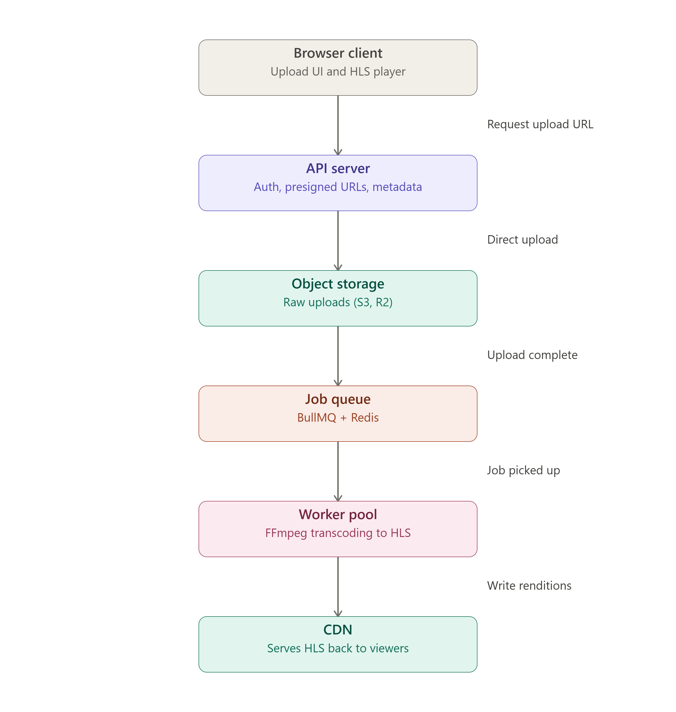
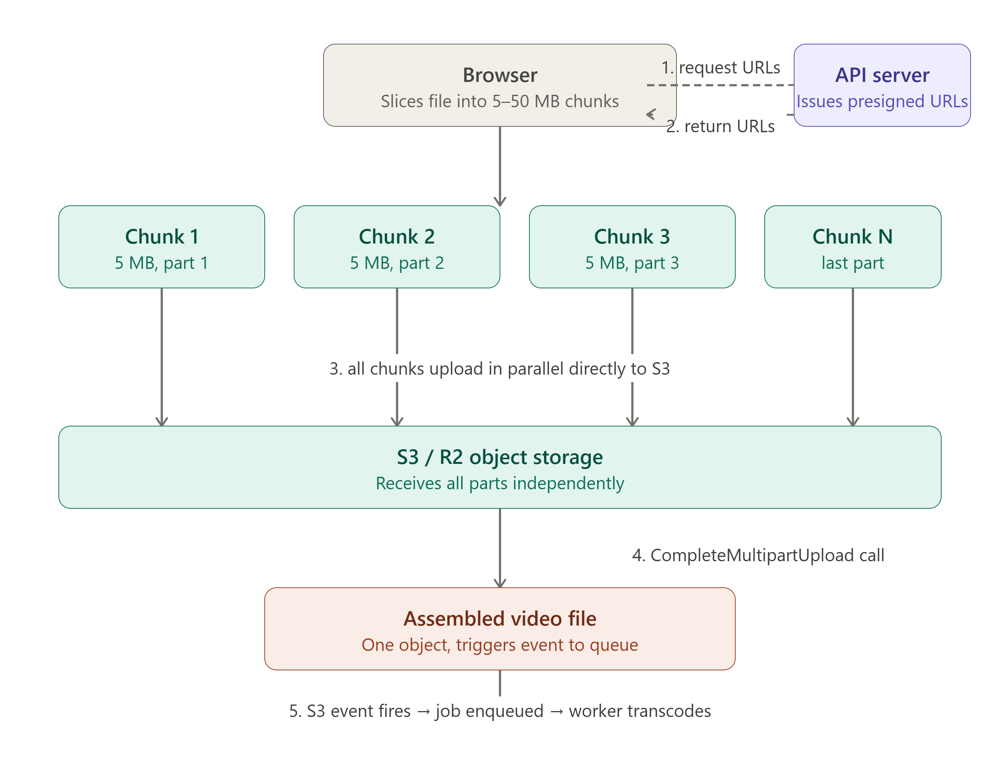

### FFMEPG 
Using the FFmpeg as the transcoder for video streaming is a common practice due to its versatility and support for a wide range of codecs and formats. FFmpeg can be used to convert video files into different formats, resize videos, extract audio, and even stream live video.  
__Basic use of the FFmpeg is to trancode the video to a format that is compatible with the streaming protocol you are using (e.g., HLS, DASH, RTMP).__   

### Working of the Streaming part

### TUS and S3 object store  
When you store a video platform's raw uploads on your own server's disk, you have a single point of failure, a size limit, and a scaling problem. When you store them in S3, they're durable across multiple data centers, instantly accessible from anywhere, and you only pay for what you use.   
S3 has a built-in mechanism called multipart upload that solves the chunking problem. The idea is simple: instead of sending one giant HTTP request, the client breaks the file into pieces (minimum 5MB each) and sends each piece independently. S3 reassembles them on its side.  
  

Even with multipart uploads, the browser code above has a silent flaw: if the tab closes or the network drops mid-upload, on reload you'd start from scratch again. You've lost the already-uploaded chunks because your browser has no memory of them — all the state (uploadId, which chunks already succeeded) was in JavaScript memory, which is now gone.  
TUS (open.tus.io) is a protocol that solves exactly this. It adds an "offset" layer on top of chunked uploads — before uploading anything, the client registers the upload and gets back a URL. Every uploaded chunk is acknowledged with a byte offset. On reconnect, the client first asks "how far did I get?" and the server replies with the current offset, then the client resumes from exactly that point.  
TUS is not a library — it's an HTTP-based open protocol with implementations in every language. tus-node-server is just Node's implementation of the TUS server spec.   

___DATABSE (POSTGRES) STORING THE Metadata for it__

### BULLMQ AND REDIS  

### Specs using for local testing and production

LOCAL - Production - what for  
Minlo -  S3        -  Object store  
Redis+BullMq - redis(maybe) - queue